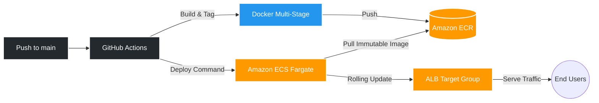

<div align="center">
  

  <h1 align="center" style="font-weight: 900; font-size: 3rem; letter-spacing: -1px; margin-bottom: 10px;">
    CloudForge CI/CD
  </h1>

  <p align="center" style="font-size: 1.2rem; color: #666; margin-bottom: 25px;">
    <strong>Enterprise-grade, zero-downtime automated deployment infrastructure on AWS.</strong>
  </p>

  <p align="center">
    <a href="https://github.com/ruthwik-thotapelli/CloudForge-AWS-DevOps-CI-CD-Infrastructure-for-Secure-Deployments/actions/workflows/deploy.yml">
      
    </a>
    
    
    
  </p>

  <p align="center">
    <a href="#-the-architecture">Architecture</a> •
    <a href="#-core-capabilities">Capabilities</a> •
    <a href="#-pipeline-lifecycle">Pipeline</a> •
    <a href="#-quick-start">Quick Start</a>
  </p>
</div>

<br />

> **CloudForge** is a blueprint for how modern product teams ship code. It replaces fragile deployment scripts with a robust, automated pipeline that handles multi-stage Docker builds, private ECR registry management, and zero-downtime rolling updates to Amazon ECS. 

<br />

## ⚡ Core Capabilities

<table>
  <tr>
    <td width="50%">
      <h3>🔄 Fully Automated CI/CD</h3>
      <p>Every push to <code>main</code> triggers a 7-stage GitHub Actions pipeline. Features concurrency locking, immutable SHA tagging, and automated deployment to AWS ECS in under 3 minutes.</p>
    </td>
    <td width="50%">
      <h3>🐳 Multi-Stage Docker</h3>
      <p>Aggressively optimized containerization. Reduces Node.js image footprint from <b>900MB to 120MB</b> using Alpine Linux, executes as a non-root user, and embeds native ECS health checks.</p>
    </td>
  </tr>
  <tr>
    <td width="50%">
      <h3>🛡️ Absolute DevSecOps</h3>
      <p>Zero credentials in source code. Utilizes encrypted GitHub Secrets, least-privilege IAM policies, private ECR registries, and pinned action versions to thwart supply-chain attacks.</p>
    </td>
    <td width="50%">
      <h3>🔁 Zero-Downtime Rollouts</h3>
      <p>Leverages AWS ECS rolling deployments. The pipeline acts as a <b>Health Gate</b>, automatically halting bad deployments before they reach end users, with instantaneous rollback support.</p>
    </td>
  </tr>
</table>

<br />

## 🏗 The Architecture

CloudForge is engineered for scalability and strict separation of concerns.



<br />

## 🛣 Pipeline Lifecycle

The deployment engine is strictly sequential and concurrent-locked to ensure data integrity during rapid pushes.

1. **Checkout**: Clones the exact commit triggered by the webhook.
2. **AWS Auth**: Assumes roles via encrypted secrets (`aws-actions/configure-aws-credentials@v4`).
3. **Registry Login**: Authenticates Docker CLI with your private ECR.
4. **Build Matrix**: Compiles the optimized `node:18-alpine` multi-stage image.
5. **Immutable Tagging**: Pushes the image tagged with **both** `latest` and the precise `$GITHUB_SHA`.
6. **ECS Rollout**: Instructs Fargate to pull the new SHA and orchestrate a rolling task replacement.
7. **Health Gate**: The pipeline intentionally hangs until the AWS Application Load Balancer reports `200 OK` on the `/health` endpoint for all new tasks.

<br />

## 🔍 Why Multi-Stage Docker?

CloudForge doesn't just put code in a container. It optimizes it for the cloud.

```diff
- FROM node:18
+ FROM node:18-alpine AS builder
+ WORKDIR /app
+ COPY package*.json ./
+ RUN npm ci --only=production

+ FROM node:18-alpine AS production
+ RUN addgroup -S appgroup && adduser -S appuser -G appgroup
+ WORKDIR /app
+ COPY --from=builder /app/node_modules ./node_modules
+ COPY --chown=appuser:appgroup . .
- USER root
+ USER appuser
+ HEALTHCHECK --interval=30s --timeout=5s --retries=3 CMD wget --spider http://localhost:3000/health || exit 1
```

<br />

## 🚀 Quick Start

### 1. Configure GitHub Secrets
Your repository needs the keys to the kingdom. Add these to **Settings → Secrets and variables → Actions**:

| Key | Description |
|---|---|
| `AWS_ACCESS_KEY_ID` | Your IAM Access Key |
| `AWS_SECRET_ACCESS_KEY` | Your IAM Secret Key |
| `AWS_REGION` | e.g., `us-east-1` |
| `ECR_REPOSITORY` | e.g., `cloudforge-app` |
| `ECS_CLUSTER` | e.g., `cloudforge-cluster` |
| `ECS_SERVICE` | e.g., `cloudforge-service` |

### 2. Trigger the Forge
```bash
git add .
git commit -m "chore: initiate cloudforge deployment"
git push origin main
```
Navigate to the **Actions** tab to watch the orchestration live.

<br />

<div align="center">
  <p>Crafted with precision by <strong>Thotapelli Ruthwik</strong>.</p>
  <a href="https://github.com/ruthwik-thotapelli">
    
  </a>
  <a href="https://www.linkedin.com/in/ruthwik-thotapelli">
    
  </a>
</div>
