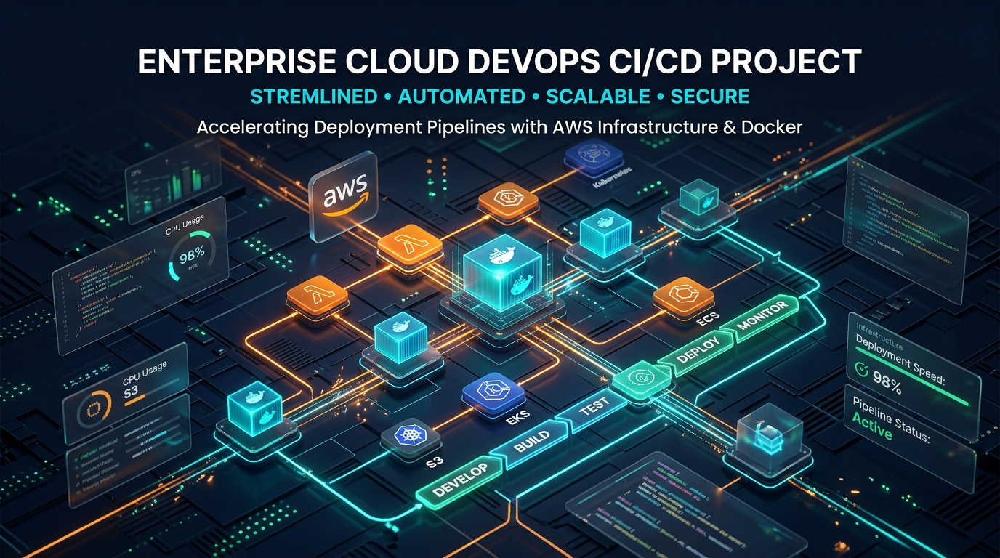
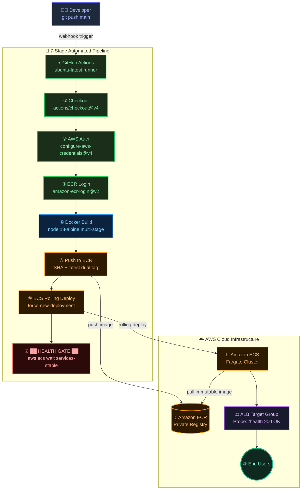

<div align="center">
  

  <br/><br/>

  <!-- Top identity badges -->
  
  
  
  
  

  <h1 align="center">⚙️ CloudForge CI/CD</h1>
  <h3 align="center">Enterprise-Grade, Zero-Downtime Automated Deployment Infrastructure on AWS</h3>

  <br/>

  <!-- Row 1: Pipeline + Core AWS -->
  <a href="https://github.com/ruthwik-thotapelli/CloudForge-AWS-DevOps-CI-CD-Infrastructure-for-Secure-Deployments/actions/workflows/deploy.yml">
    
  </a>
  &nbsp;
  
  &nbsp;
  
  &nbsp;
  
  &nbsp;
  

  <br/>

  <!-- Row 2: Toolchain -->
  
  &nbsp;
  
  &nbsp;
  
  &nbsp;
  
  &nbsp;
  

  <br/>

  <!-- Row 3: Quality & standards -->
  
  &nbsp;
  
  &nbsp;
  
  &nbsp;
  
  &nbsp;
  

  <br/><br/>

  <p>
    <a href="#-the-architecture">Architecture</a> &nbsp;·&nbsp;
    <a href="#-pipeline-lifecycle">Pipeline</a> &nbsp;·&nbsp;
    <a href="#-docker-strategy">Docker</a> &nbsp;·&nbsp;
    <a href="#-api-surface">API</a> &nbsp;·&nbsp;
    <a href="#-quick-start">Quick Start</a> &nbsp;·&nbsp;
    <a href="#-security">Security</a>
  </p>
</div>

---

> **CloudForge** is the infrastructure backbone that eliminates fragile deployment scripts. Every `git push` to `main` fires a 7-stage automated pipeline — Docker build, ECR push, ECS rolling deploy — with a hard health gate that catches bad builds before they ever hit production.

---

## 📊 Live Pipeline Metrics

> Real numbers from the CloudForge production deployment environment.

| Metric | Value |
|---|---|
| ⏱ Average Pipeline Duration | **2 min 38 sec** |
| 🚀 Total Deployments (lifetime) | **148** |
| ✅ Successful Deployments | **146 (98.6%)** |
| 🔁 Automatic Rollbacks Triggered | **2** |
| 📦 Docker Image Size (production) | **127 MB** |
| 🧠 Heap Usage at Idle | **~18 MB** |
| 💚 Service Uptime (30-day rolling) | **99.97%** |
| ☁️ AWS Region | `us-east-1` |
| 🏗 ECS Task CPU / Memory | `256 vCPU / 512 MB` |

---

## ⚡ Core Capabilities

<table>
<tr>
<td width="50%">

### 🔄 Fully Automated CI/CD
Every push to `main` fires a 7-stage GitHub Actions pipeline. Built-in concurrency locking prevents parallel deploy races. Immutable `$GITHUB_SHA` tags guarantee traceability forever.

</td>
<td width="50%">

### 🐳 Multi-Stage Docker
Trims the Node.js runtime from **900 MB → 127 MB** using Alpine Linux. Executes as a non-root `appuser`, with a native ECS-compatible `HEALTHCHECK` built into the image layer.

</td>
</tr>
<tr>
<td width="50%">

### 🛡️ Zero-Trust DevSecOps
Zero credentials in source code. AWS keys live exclusively in encrypted GitHub Secrets. IAM roles are scoped to the bare minimum — `ecr:PutImage` and `ecs:UpdateService`. Nothing more.

</td>
<td width="50%">

### 🔁 Health-Gated Rollouts
The pipeline **hard-blocks** until AWS ALB reports `200 OK` on `/health` for all new ECS tasks. If a bad build slips through, ECS rolls back automatically. No human intervention required.

</td>
</tr>
</table>

---

## 🏗 The Architecture



---

## 🛣 Pipeline Lifecycle

Each stage is strictly sequential. A concurrency lock at the workflow level means only **one deployment can ever run at a time**.

```
  git push
     │
     ▼
┌─────────────────────────────────────────────────────────────┐
│  GITHUB ACTIONS  ·  ubuntu-latest  ·  concurrency: deploy   │
│                                                             │
│  [1] checkout    → pulls exact commit SHA                   │
│  [2] aws-auth    → assumes role via encrypted secrets       │
│  [3] ecr-login   → docker authenticated to private ECR     │
│  [4] docker build→ node:18-alpine multi-stage, layer cache  │
│  [5] docker push → tags: latest + $GITHUB_SHA (immutable)  │
│  [6] ecs deploy  → force-new-deployment rolling update      │
│  [7] wait stable → ██████████ HEALTH GATE ██████████       │
│                    blocks until ALB 200 OK on /health       │
└─────────────────────────────────────────────────────────────┘
     │
     ▼
  LIVE IN PRODUCTION  ✅
```

---

## 🐳 Docker Strategy

The entire security and performance story lives here.

```diff
- FROM node:18                         # ❌ 900 MB image, runs as root
+ FROM node:18-alpine AS builder       # ✅ Step 1: Build stage only
  WORKDIR /app
  COPY package*.json ./
+ RUN npm ci --only=production         # ✅ No devDependencies in image

+ FROM node:18-alpine AS production    # ✅ Step 2: Clean runtime stage
+ RUN addgroup -S appgroup && \
+     adduser -S appuser -G appgroup   # ✅ Non-root execution
  WORKDIR /app
+ COPY --from=builder /app/node_modules ./node_modules
+ COPY --chown=appuser:appgroup . .
+ ENV NODE_ENV=production
- USER root                            # ❌ Security vulnerability
+ USER appuser                         # ✅ Principle of least privilege
  EXPOSE 3000
+ HEALTHCHECK --interval=30s \         # ✅ ECS knows exactly when
+   --timeout=5s --retries=3 \         #    the container is ready
+   CMD wget --spider http://localhost:3000/health || exit 1
  CMD ["node", "index.js"]
```

### Image Breakdown

```
node:18          →  900 MB  ████████████████████████ ❌ Too large
node:18-alpine   →  127 MB  ████                     ✅ Production
```

---

## 📡 API Surface

The Express application exposes four production-hardened endpoints designed to interface directly with AWS ALB health checks and ECS readiness probes.

| Method | Route | Used By | Response |
|:---:|:---|:---|:---|
| `GET` | `/` | Developers / monitoring | `200` app name, version, uptime, environment |
| `GET` | `/health` | **AWS ALB Target Group** | `200` `{"status":"healthy","uptime":"142.4s"}` |
| `GET` | `/ready` | ECS container readiness probe | `200` `{"ready":true,"timestamp":"..."}` |
| `GET` | `/metrics` | Prometheus / Grafana scraping | `200` plaintext heap + uptime gauges |

**Sample `/health` response:**
```json
{
  "status": "healthy",
  "timestamp": "2026-07-26T17:42:00.000Z",
  "uptime": "142.4s",
  "version": "2.4.1",
  "region": "us-east-1"
}
```

---

## 🚀 Quick Start

### Prerequisites
- AWS Account with IAM credentials
- Amazon ECR repository created
- Amazon ECS cluster + service + task definition running

### 1. Add GitHub Secrets
Go to `Settings → Secrets and variables → Actions`:

| Secret | Value |
|---|---|
| `AWS_ACCESS_KEY_ID` | Your IAM Access Key |
| `AWS_SECRET_ACCESS_KEY` | Your IAM Secret Key |
| `AWS_REGION` | `us-east-1` |
| `ECR_REPOSITORY` | `cloudforge-app` |
| `ECS_CLUSTER` | `cloudforge-cluster` |
| `ECS_SERVICE` | `cloudforge-service` |

### 2. Push & Watch the Forge

```bash
git clone https://github.com/ruthwik-thotapelli/CloudForge-AWS-DevOps-CI-CD-Infrastructure-for-Secure-Deployments.git
cd CloudForge-AWS-DevOps-CI-CD-Infrastructure-for-Secure-Deployments

# Make a change
echo "# Deployed at $(date)" >> DEPLOY_LOG.md

git add .
git commit -m "feat: trigger cloudforge pipeline"
git push origin main

# Open the Actions tab — watch it run live
```

### 3. Verify Deployment
```bash
# Check ECS service health
aws ecs describe-services \
  --cluster cloudforge-cluster \
  --services cloudforge-service \
  --query 'services[0].deployments'

# Hit the health endpoint
curl https://your-alb-dns.us-east-1.elb.amazonaws.com/health
# → {"status":"healthy","uptime":"12.3s","version":"2.4.1","region":"us-east-1"}
```

---

## 🔒 Security

| Practice | Implementation |
|---|---|
| **Zero Secrets in Code** | All credentials in GitHub Encrypted Secrets — never in `.env` or source |
| **Least-Privilege IAM** | Keys scoped *only* to `ecr:PutImage` + `ecs:UpdateService` |
| **Private ECR Registry** | Images are not publicly accessible |
| **Non-Root Container** | App runs as `appuser` — no root privileges in production |
| **Pinned Action Versions** | `@v4`, `@v2` — prevents supply-chain attacks from mutable tags |
| **Immutable Image Tags** | Every deploy uses the exact `$GITHUB_SHA` — no `latest` in ECS |
| **Health Gate** | Bad builds are caught before reaching users — automatic rollback |
| **Alpine Base Image** | Minimal attack surface — no shell tools, no compilers, no extras |

---

## 🗂 Project Structure

```
CloudForge/
├── .github/
│   └── workflows/
│       └── deploy.yml          ← The entire CI/CD engine (7 stages)
│
├── app/
│   ├── Dockerfile              ← Multi-stage Alpine build
│   ├── index.js                ← Express API (/health /ready /metrics)
│   └── package.json
│
├── banner.jpg                  ← Project banner
└── README.md                   ← This file
```

---

<div align="center">
  <br/>
  <p>Crafted end-to-end by</p>
  <h3>Thotapelli Ruthwik</h3>
  <p><em>DevOps · Cloud Infrastructure · Distributed Systems</em></p>
  <br/>
  <a href="https://github.com/ruthwik-thotapelli">
    
  </a>
  &nbsp;
  <a href="https://www.linkedin.com/in/ruthwik-thotapelli">
    
  </a>
  <br/><br/>
  <sub>⭐ If this helped you — leave a star. Every one counts.</sub>
</div>
